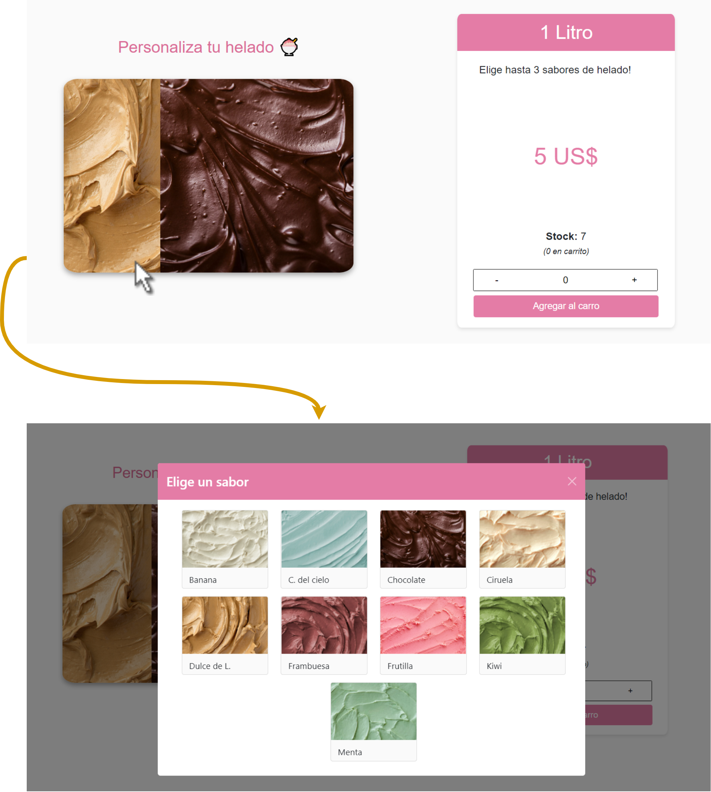

**Scoop** es un sitio web e-commerce de venta de helados donde podrás:

- Ver y filtrar un listado de helados por categoría
- Seleccionar un producto para verlo en más detalle
- Agregar productos al carrito
- Registrarte para realizar una compra
- Ver tu historial de compras

# Features

Gracias al virtual DOM que maneja React, es posible renderizar una única vez la barra de navegación y el pie de página. El flujo de las vistas principales de la página pueden observarse en la siguiente imagen:

**[1]** Muestra un listado de productos seleccionables, los cuales pueden ser filtrados utilizando URL Params

**[2]** Pueden verse los productos más detalládamente. Adicionalmente, el tipo de productos 'Recipiente' permite 
personalizar el producto como se muestra en la siguiente imagen:

**[3]** Se podrá agregar productos al carrito, los cuales pueden ser adquiridos solo al iniciar sesión y llenar un formulario. Estos además son guardados en el local storage del navegador.

**[4]** Al usuario se le permitirá ver un registro de sus órdenes de compra. Si este desea ver el "recibo" de su compra podrá descargarlo en formato pdf:

# Tech

Scoop usa algunas de las tecnologías más populares dentro de la programación web:

- [ReactJS] - Utilizado para el front end de la aplicación
- [Typescript] - Lenguaje de fuerte tipado para trabajar con React de forma más organizada y segura.
- [Firebase] - Base de datos no relacional y serverless proveída por Google.
- [CSS] - Utilizado para dar estilos a los componentes de la página.

# Libraries

Dentro de React, son utilizadas las siguientes librerías:

- [[React-Bootrstrap]](https://react-bootstrap.github.io/) - Librería de React utilizada para facilitar componentes prediseñados.
- [[React-Router-Dom]](https://v5.reactrouter.com/web/api/Redirect) - Fundamental para la selección de vistas de la aplicación sin necesidad de recargar la página.
- [[Typescript]](https://www.typescriptlang.org/docs/handbook/react.html) - Utilizada para hacer posible el uso de typescript dentro del framework, además de servir como aprendizaje durante la realización del proyecto.
- [[Firebase]](https://firebaseopensource.com/projects/rakannimer/react-firebase/) - Utilizada para comunicar la base de datos con React. Además, facilita la implementación del sistema de autenticación.
- [[PDF-Lib]](https://pdf-lib.js.org/) - Utilizado para generar los recibos de compras. No es una librería indispensable, aunque se usa con el fin de darle un toque creativo a la página.

# Instructions

Estas instrucciones fueron automáticamente generadas por react-create-app

## Available Scripts

In the project directory, you can run:

### `npm start`

Runs the app in the development mode.\
Open [http://localhost:3000](http://localhost:3000) to view it in your browser.

The page will reload when you make changes.\
You may also see any lint errors in the console.

### `npm test`

Launches the test runner in the interactive watch mode.\
See the section about [running tests](https://facebook.github.io/create-react-app/docs/running-tests) for more information.

### `npm run build`

Builds the app for production to the `build` folder.\
It correctly bundles React in production mode and optimizes the build for the best performance.

The build is minified and the filenames include the hashes.\
Your app is ready to be deployed!

See the section about [deployment](https://facebook.github.io/create-react-app/docs/deployment) for more information.

### `npm run eject`

**Note: this is a one-way operation. Once you `eject`, you can't go back!**

If you aren't satisfied with the build tool and configuration choices, you can `eject` at any time. This command will remove the single build dependency from your project.

Instead, it will copy all the configuration files and the transitive dependencies (webpack, Babel, ESLint, etc) right into your project so you have full control over them. All of the commands except `eject` will still work, but they will point to the copied scripts so you can tweak them. At this point you're on your own.

You don't have to ever use `eject`. The curated feature set is suitable for small and middle deployments, and you shouldn't feel obligated to use this feature. However we understand that this tool wouldn't be useful if you couldn't customize it when you are ready for it.

## Learn More

You can learn more in the [Create React App documentation](https://facebook.github.io/create-react-app/docs/getting-started).

To learn React, check out the [React documentation](https://reactjs.org/).

### Code Splitting

This section has moved here: [https://facebook.github.io/create-react-app/docs/code-splitting](https://facebook.github.io/create-react-app/docs/code-splitting)

### Analyzing the Bundle Size

This section has moved here: [https://facebook.github.io/create-react-app/docs/analyzing-the-bundle-size](https://facebook.github.io/create-react-app/docs/analyzing-the-bundle-size)

### Making a Progressive Web App

This section has moved here: [https://facebook.github.io/create-react-app/docs/making-a-progressive-web-app](https://facebook.github.io/create-react-app/docs/making-a-progressive-web-app)

### Advanced Configuration

This section has moved here: [https://facebook.github.io/create-react-app/docs/advanced-configuration](https://facebook.github.io/create-react-app/docs/advanced-configuration)

### Deployment

This section has moved here: [https://facebook.github.io/create-react-app/docs/deployment](https://facebook.github.io/create-react-app/docs/deployment)

### `npm run build` fails to minify

This section has moved here: [https://facebook.github.io/create-react-app/docs/troubleshooting#npm-run-build-fails-to-minify](https://facebook.github.io/create-react-app/docs/troubleshooting#npm-run-build-fails-to-minify)
