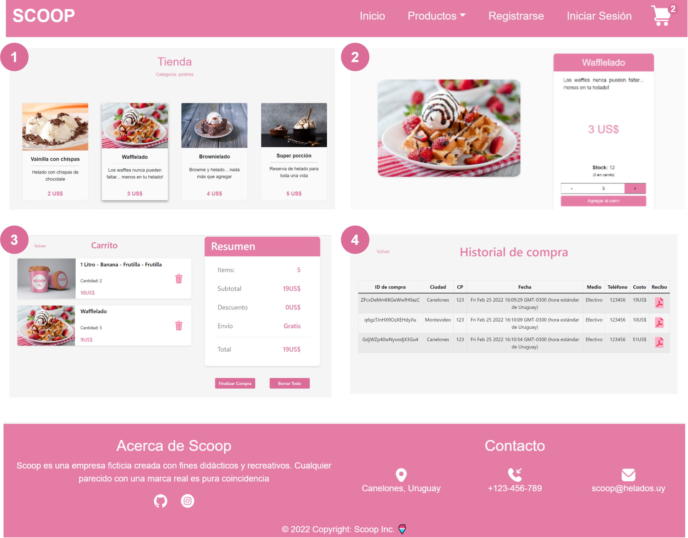
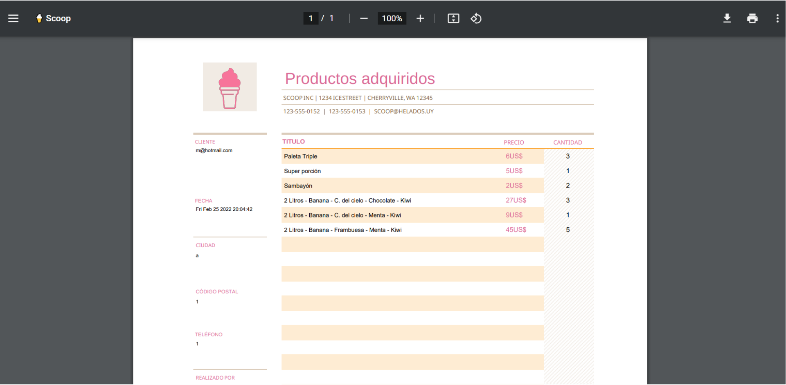

**Scoop** is an e-commerce website for selling ice cream where you can:

- View and filter a list of ice creams by category
- Select a product to see it in more detail
- Add products to cart
- Register to make a purchase
- View your purchase history

# Tech

Scoop uses some of the most popular technologies in web programming:

- [ReactJS] - Used for the front end of the application
- [Typescript] - Strongly typed language to work with React in a more organized and secure way.
- [Firebase] - Non-relational and serverless database provided by Google.
- [CSS] - Used to style page components.

# Features

Thanks to the virtual DOM handled by React, it is possible to render the navigation bar and the footer only once. The flow of the main page views can be seen in the following image:

**[1]** Displays a list of selectable products, which can be filtered using URL Params

**[2]** You can see the products in more detail. Additionally, the 'Container' product type allows
customize the product as shown in the following picture:

**[3]** Products can be added to the cart, which can be purchased only by logging in and filling out a form. These are also saved in the browser's local storage.

**[4]** The user will be allowed to view a record of their purchase orders. If you want to see the "receipt" for your purchase, you can download it in pdf format:

# Libraries

- [[React-Bootrstrap]](https://react-bootstrap.github.io/) - React library used to facilitate pre-built components.
- [[React-Router-Dom]](https://v5.reactrouter.com/web/api/Redirect) - Essential for selecting application views without needing to reload the page.
- [[Typescript]](https://www.typescriptlang.org/docs/handbook/react.html) - Used to make the use of typescript possible within React.
- [[Firebase]](https://firebaseopensource.com/projects/rakannimer/react-firebase/) - Used to communicate the database with React. In addition, it facilitates the implementation of the authentication system.
- [[PDF-Lib]](https://pdf-lib.js.org/) - Used to generate purchase receipts. It is not an essential library, although it is used in order to give a creative touch to the page.